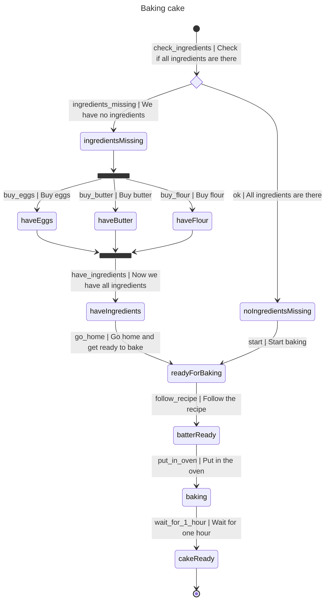
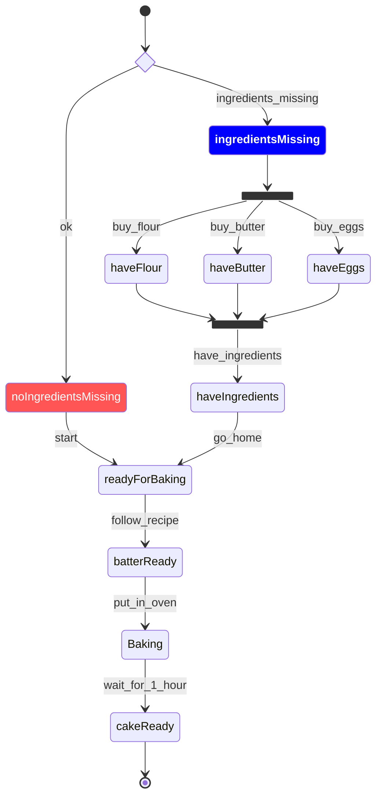
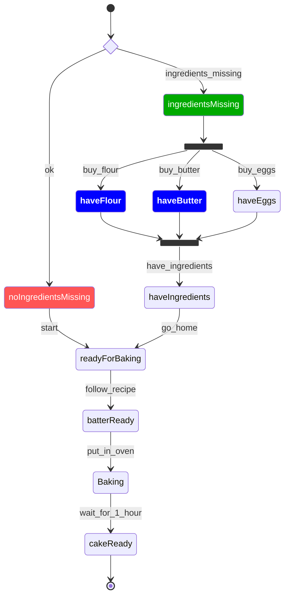
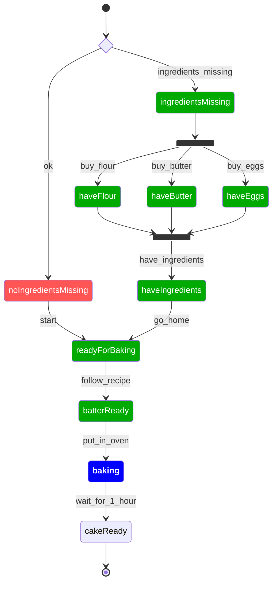
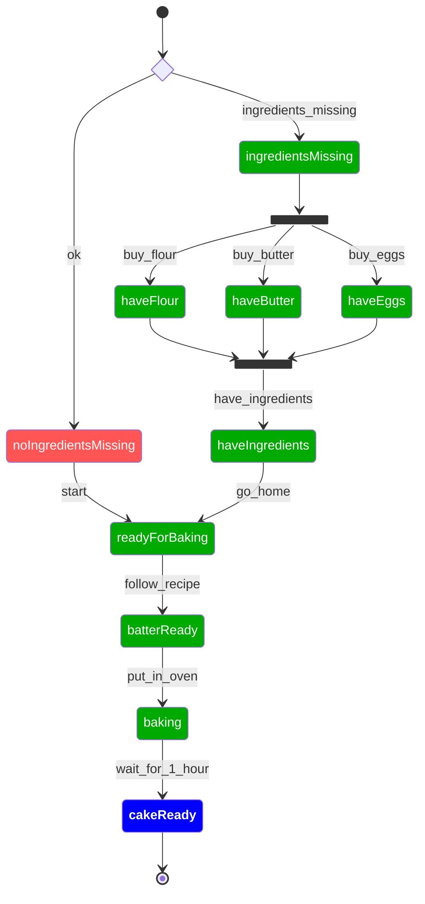

# Tutorial: baking a cake

In this tutorial you are going to model a recipe to bake a simple Quatre Quarts cake as a FnO-Steps workflow.
1. You will bake a cake (optional).
1. You will make a [Mermaid](https://mermaid.ai/web/) diagram to have a visual representation of the workflow.
1. You will use the tool [to-steps](https://github.com/FnOio/to-steps) to turn the Mermaid diagram into a FnO-Steps
workflow. 
1. Then you'll ask the workflow composer what to do, depending on the situation at that time.
1. Finally, you will add some [notation3](https://notation3.org/) (N3) reasoning to the workflow to model
the temporal constraint of waiting for one hour before checking if the cake is ready.

## The recipe
### Ingredients
- 250 g self-raising flour
- 250 g sugar
- 250 g butter
- 4 eggs

### Procedure
1. Heat the oven to 175°C.
2. Break the eggs, add the sugar. Beat until it's a light-yellow mixture.
3. Melt the butter, let it cool down a bit and add to the egg mixture while mixing at low speed.
4. Sift the flour over the mixture, then gently mix with a rubber spatula.
5. Add a little bit of salt, mix gently.
6. Butter and flour a cake pan, then put the batter in the pan.
7. Put in the oven. After 1 hour, check for doneness with a knife: if it comes out clean, the cake is done.

**Note**: This is a real recipe. Try it out!

## The workflow
In real life, it takes more than just following this recipe.
For example, you need to check if you have all the ingredients before you can start.
If so, you can start baking.
If not, you need to buy them first. This is what we are going to model in the workflow.

The workflow shows some features of the FnO-Steps workflow composer:
- Choice: check if we have all ingredients, or if some are missing. At this point we can either choose one path or the other 
(exclusive OR).
- Fork: if some ingredients are missing, we can buy them in any order, but we can only continue if we have them all (AND).
- Reasoning: at the end we have to wait for one hour to check the cake. This is a temporal constraint, which we can model with reasoning.

Modeled in Mermaid, the workflow looks like this:

Here's the source code: [workflow.mmd](src/test/resources/scenarios/bakingCake/workflow.mmd).
You will need it to turn it into a FnO-Steps workflow in the next step.

## Mermaid to FnO-Steps
The next step is to turn this Mermaid diagram into a [FnO-Steps](https://w3id.org/imec/ns/fno-steps#) workflow.
FnO-Steps describes the concepts of *steps*, *states* and *shapes* to model data driven workflows using RDF.
A *state* describes a condition of the world, for example "have_ingredients" or "batter_ready".
A *step* describes a transition from one step to another. It typically represents an action that can be taken, for example "check_ingredients".
A *shape* describes the conditions under which a step can be taken. This is represented as a [SHACL](https://www.w3.org/TR/shacl/) shape,
which can be used to check if the conditions are met given some data.

You can do this with the [to-steps](https://github.com/FnOio/to-steps) tool.
However, this tool converts the diagram into an intermediate non-RDF format, while FnO-Steps is RDF-based.
It provides default [YARRRML](https://rml.io/yarrrml/) mappings to do the conversion to RDF,
but you can provide your own mappings better suited to your use case.

Luckily a Docker image is provided to do the conversion from Mermaid to FnO-Steps directly.
For this tutorial it is advised to use the Docker image as described [here](https://github.com/FnOio/to-steps#running-the-complete-pipeline-with-docker--podman).

So after installing the container we can run the following command to convert the Mermaid diagram into a FnO-Steps workflow:
```bash
 docker container run --rm -v "$(pwd)":/mnt/data to-steps -o /out workflow.mmd
```
- `--rm` removes the container instance after running it.
- `-v "$(pwd)":/mnt/data` mounts the current directory (`pwd`) on the host to the directory `/mnt/data` in the container. You can replace `"$(pwd)"` with whatever absolute path to your data. However, the volume *should* be mounted to `/mnt/data` in the container for the pipeline to work.
- `to-steps`: name of the image.
- `-o /out`: The output directory. In this case it will be `$(pwd)/out`
- `workflow.mmd`: The input file (the cake baking Mermaid diagram).

This will put a number of files in the given output directory:
- `states.csv`, `shapes.csv`, `steps.json`: the states, shapes and steps of the workflow in intermediate format.
- `mapping.yarrrml.yaml`, `mapping.rml.ttl`: the YARRRML and RML mappings used to convert the intermediate format to RDF.
- `states.ttl`, `shapes.ttl`, `steps.ttl`: the states, shapes and steps of the workflow in RDF format, ready to be used by the workflow composer.

## Running the workflow composer
Now we have the workflow in RDF format, we can run the workflow composer to see what steps we can take given some context data.
Assuming you have the workflow composer set up as described in the [README](README.md), we will give it some data to see what it recommends us to do.
But before we can do that, we need to add one more thing to the workflow.

### Goal state(s)

The workflow composer needs to know what the end- or goal states are.
In this case, the only goal state is "cakeReady". We can find the identifier (IRI) of that state
in `states.ttl` and add it to a file called [`goalStates.txt`](src/test/resources/scenarios/bakingCake/goalStates.txt)
in the same directory as the workflow
files:
```
http://localhost:8000/states#cakeReady
```
If there were other goal states, we would add them in the same file, one per line.

### Data & first run

Now we can add some data to the workflow.
We start with an "empty" state; we don't know if we have ingredients or not, we haven't done anything yet.
So there's just you.
Add a file called [`data_1.ttl`](src/test/resources/scenarios/bakingCake/data_1.ttl)
with the following content (in the same directory as the workflow files):
```turtle
PREFIX : <http://example.com/ns#>
PREFIX schema: <https://schema.org/>

:me a schema:Thing .    # True in certain ways; this is the default generated target class. Can be overridden by providing different mappings.
```

Now we can run the workflow composer with this data:
```bash
java -jar /path/to/wc2j-<version>.jar -i . --context data_1.ttl
```

This generates an output directory structure like this in the workflow directory:
```
output/
└── data_1
    ├── context_after_reasoning.ttl
    ├── plan.mmd
    ├── plan.ttl
    └── plan.txt
```

`output` is the default output directory if not given with the `-o` parameter. 
Inside it, a subdirectory is created for every context file processed, in this case `data_1`.
- `context_after_reasoning.ttl` is the context after reasoning. Since we haven't provided any reasoning, it is the same as the input context.
- `plan.mmd` is a Mermaid diagram of the recommended next steps to take, given the input context.
You can paste it in the [Mermaid live editor](https://mermaid.live/) to see it visually.
Since the context is pretty empty, the plan looks like the original workflow plan.
- `plan.ttl` is the [P-Plan](https://www.opmw.org/model/p-plan/) representation of the same plan.
- `plan.txt` is a human-readable textual version of the plan.

Now let's make it more interesting and change the context.
We discovered we have no ingredients, so we need to buy them. 
We can add this information to the context with the following file called
[`data_2.ttl`](src/test/resources/scenarios/bakingCake/data_2.ttl):

```turtle
PREFIX : <http://example.com/ns#>
PREFIX schema: <https://schema.org/>

:me a schema:Thing ;
    :ingredientsMissing true .
```

Now we can run the workflow composer again with this new context:
```bash
java -jar /path/to/wc2j-<version>.jar -i . --context data_2.ttl
```

The output plan now looks different, because we have indicated that we have no ingredients, 
so the workflow composer recommends us to buy them first.
This looks like this ([output/data_2/plan.mmd](src/test/resources/scenarios/bakingCake/expected_output_data_2/plan.mmd)):

This shows a few things:
- The state `ingredientsMissing` is marked as *current* (blue), because we have indicated in the context that we have no ingredients.
- The state `noIngredientsMissing` is marked as *no option* (red), because this path cannot be followed now (exclusive OR).
- The other states are not marked; these are the steps still to be done.

Now we can do a similar thing to add the ingredients. Fast-forward, we have bought the flour and the butter,
but we still need to buy the eggs.
This can be represented in the context with the following file called [`data_3.ttl`](src/test/resources/scenarios/bakingCake/data_3.ttl):

```turtle
PREFIX : <http://example.com/ns#>
PREFIX schema: <https://schema.org/>

:me a schema:Thing ;
    :ingredientsMissing true ;
    :haveFlour true ;
    :haveButter true .
```

The resulting plan looks like this ([output/data_3/plan.mmd](src/test/resources/scenarios/bakingCake/expected_output_data_3/plan.mmd)):


Note that the state `ingredientsMissing` is now marked as *done* (green), because we have already done the step of
checking if we have ingredients.

### Reasoning

We need to add some reasoning to the workflow. In the last step of the workflow we have to wait for one hour
before we can check if the cake is ready.
This is a temporal constraint, which we can model with reasoning.
We introduce a simple "timer" counting down minutes, which we can use to check if one hour has passed or not.
If the timer is at 0, we can check the cake. If not, we have to wait some more.

The context (data) then looks like this ([`data_4_1_before_wait.ttl`](src/test/resources/scenarios/bakingCake/data_4_1_before_wait.ttl)):
```turtle
PREFIX : <http://example.com/ns#>
PREFIX schema: <https://schema.org/>

:me a schema:Thing ;
    :haveFlour true ;
    :haveButter true ;
    :haveEggs true ;
    :haveIngredients true ;
    :haveIngredientsCake true ;
    :readyForBaking true ;
    :batterReady true ;
    :baking true .

# The timer is started at the moment we start baking. It's set to 1 hour.
:timer a :Timer ;
    :timerDuration 60 .
```

We can add the following N3 file to the input directory, 
called [`knowledge.n3`](src/test/resources/scenarios/bakingCake/knowledge.n3):

```n3
PREFIX : <http://example.com/ns#>
PREFIX schema: <https://schema.org/>

# Has the timer reached 0 minutes?
{
    ?timer a :Timer .
    ?timer :timerDuration 0 .
    ?baker a schema:Thing .
}
=>
{
    ?timer :isFinished true .
    ?baker :cakeReady true .
} .
```

This rule says that if the timer has reached 0, then the cake is ready.
Since 'cakeReady' is associated with a shape that has a `schema:Thing` target class,
the `:cakeReady true` statement is attached to the baker (the `schema:Thing`), which is 'me' in this case.

Now we can run the workflow composer again with this new context and the knowledge file:
```bash
java -jar /path/to/wc2j-<version>.jar -i . --context data_4_1_before_wait.ttl --knowledge knowledge.n3
```
Then the resulting plan looks like this ([output/data_4_1_before_wait/plan.mmd](src/test/resources/scenarios/bakingCake/expected_output_data_4_1_before_wait/plan.mmd)):


If we now change the timer duration to 0 in the context,recommend us to check if the cake is
the reasoner will add the statement `:cakeReady true` to the context.
This can be seen in the file [`output/data_4_2_after_wait/context_after_reasoning.ttl`](src/test/resources/scenarios/bakingCake/expected_output_data_4_2_after_wait/context_after_reasoning.ttl):

```turtle
PREFIX : <http://example.com/ns#>
PREFIX schema: <https://schema.org/>

:me a schema:Thing ;
    :haveFlour true ;
    :haveButter true ;
    :haveEggs true ;
    :haveIngredients true ;
    :haveIngredientsCake true ;
    :readyForBaking true ;
    :batterReady true ;
    :baking true .

# The timer has gone off.
:timer a :Timer ;
    :timerDuration 0 .@prefix : <http://example.com/ns#> .

# Triples added by the reasoner:
:timer :isFinished true .
:me :cakeReady true .
```

we can see that the plan changes accordingly ([output/data_4_2_after_wait/plan.mmd](src/test/resources/scenarios/bakingCake/expected_output_data_4_2_after_wait/plan.mmd)):



Of course, one can add more complex reasoning for real-life use cases.